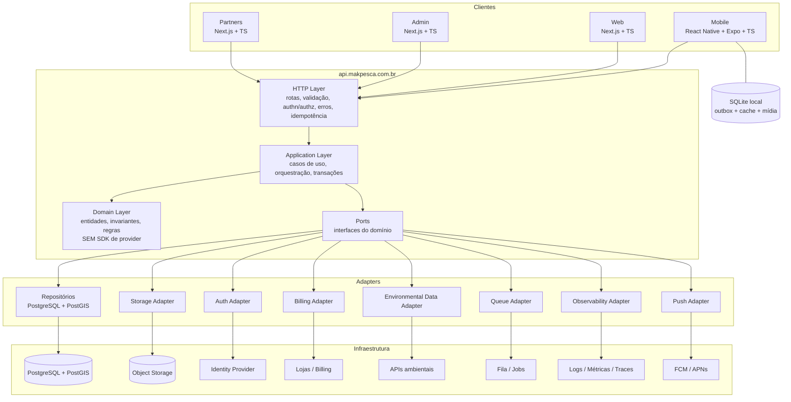

# Arquitetura de Containers

## 1. Diagrama

## 2. Containers

| Container | Tecnologia baseline | Responsabilidade |
|-----------|--------------------|------------------|
| App Mobile | React Native + Expo + TypeScript | Experiência de campo, offline-first, GPS, mapa, captura, fila de sync |
| Web | Next.js + TypeScript | Landing, conteúdo público, perfis, exploração |
| Admin | Next.js + TypeScript | Moderação, catálogos, auditoria, conciliação |
| Partners | Next.js + TypeScript | Perfil de loja, ofertas, relatórios |
| API | TypeScript (framework em ADR-0006) | Única fronteira de regra de negócio |
| Banco | PostgreSQL + PostGIS | Persistência, geometria, índices geoespaciais |
| Object Storage | via adapter | Mídia |
| Fila/Jobs | via adapter | Processamento assíncrono |
| SQLite local | expo-sqlite ou equivalente | Fonte de verdade local do dispositivo |

## 3. Camadas internas da API

| Camada | Pode depender de | Nunca depende de |
|--------|------------------|------------------|
| HTTP | Application, DTOs | Domínio interno, ORM |
| Application | Domain, Ports | Adapters concretos, SDK de provider |
| Domain | Nada externo | Framework HTTP, ORM, SDKs, ambiente |
| Ports | Tipos do domínio | Implementações |
| Adapters | Ports, SDK do provider | Regras de negócio |

Detalhe em `COMPONENT-BOUNDARIES.md`.

## 4. Restrições estruturais

1. Cliente não fala com banco. Sempre API.
2. Domínio não importa SDK.
3. DTO não é entidade de ORM.
4. Adapter não contém regra de negócio.
5. Job assíncrono usa os mesmos casos de uso, não caminhos paralelos.
6. Toda escrita sincronizável passa pelo mecanismo de idempotência.
7. Toda leitura de localização passa pela degradação de geo-privacy antes de serializar.

## 5. Dados que ficam no dispositivo

| Dado | Motivo |
|------|--------|
| Pontos e capturas do usuário | Offline-first |
| Outbox de mutações | Sincronização |
| Fila de mídia + arquivos locais | Upload retomável |
| Cursor de sync e versões | Convergência |
| Região de mapa baixada | Mapa offline (depende de ADR-0010) |
| Catálogos (espécies, iscas, técnicas) | Uso offline |

Dados de terceiros ficam no dispositivo **apenas** na precisão autorizada.
