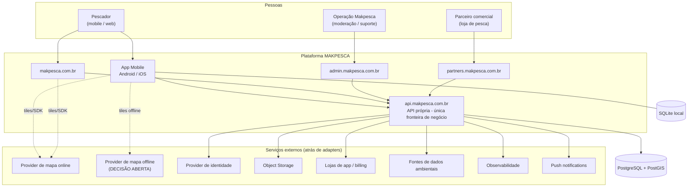

# Contexto de Sistema

## 1. Diagrama de contexto

## 2. Regra de leitura do diagrama

- Linha cheia para a API = caminho de regra de negócio.
- Linha pontilhada para providers de mapa = consumo de tiles/SDK pelo cliente, **sem**
  regra de negócio e **sem** dado sensível.
- **Não existe** seta de Mobile/Web para o banco. Isso é constitucional (Art. 2).

## 3. Atores

| Ator | Descrição | Acesso |
|------|-----------|--------|
| Pescador | Usuário final, FREE ou PRO | Mobile e Web |
| Parceiro comercial | Loja de pesca verificada | Portal de parceiros |
| Operação Makpesca | Moderação, suporte, conciliação | Admin |
| Sistema externo de billing | Lojas de aplicativo / agregador | Webhooks para a API |
| Provedor de dados ambientais | Clima, nível de rio, maré, lua | Consumido pela API |

## 4. Sistemas externos e o que atravessa a fronteira

| Sistema | Dado que sai da Makpesca | Restrição |
|---------|--------------------------|-----------|
| Provider de mapa online | Coordenadas de visualização (viewport) | **Nunca** enviar lista de pontos privados para serviço de terceiros |
| Object storage | Arquivos de mídia | Sem EXIF de GPS; chaves opacas |
| Provider de identidade | Identificador e credencial do usuário | Mínimo necessário |
| Billing | Identificador de assinatura pseudônimo | Sem dado de localização |
| Dados ambientais | Coordenada **aproximada** da consulta | Nunca coordenada exata de ponto privado |
| Observabilidade | Logs estruturados | Sem secrets nem coordenadas privadas |
| Push | Identificador de dispositivo e payload mínimo | Sem coordenada, sem conteúdo sensível |

## 5. Fronteiras de confiança

| Fronteira | Natureza |
|-----------|----------|
| Dispositivo do usuário → API | **Não confiável**: tudo é validado e autorizado no servidor |
| API → banco | Confiável, mas com menor privilégio |
| API → providers externos | Não confiável: falha esperada, timeout, dado incorreto |
| Admin → API | Autenticado, auditado, menor privilégio |
| Parceiro → API | Autenticado, escopo restrito ao próprio parceiro |

## 6. Suposições de ambiente

- Conectividade intermitente ou ausente no uso principal (campo).
- Dispositivos Android intermediários são o caso comum.
- Latência aceitável a partir do Brasil é requisito (A-015).
