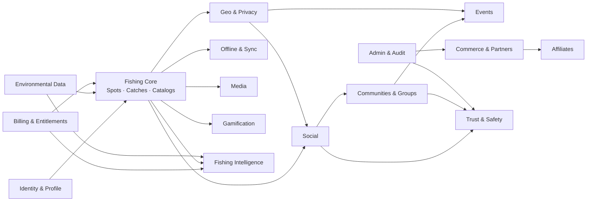

# Mapa de Domínios

## 1. Visão geral

## 2. Domínios e responsabilidades

| Domínio | Responsabilidade | Não responde por |
|---------|------------------|------------------|
| Identity & Profile | Conta, sessão, perfil público | Conteúdo de pesca |
| Fishing Core | Pontos, capturas, catálogos (espécies, iscas, técnicas), corpos d'água | Publicação social |
| Geo & Privacy | Visibilidade, precisão, degradação, compartilhamento de localização | Renderização de mapa |
| Offline & Sync | Outbox, cursores, versões, tombstones, conflitos, fila de mídia | Regra de negócio das entidades |
| Media | Upload autorizado, confirmação, derivativos, EXIF, ciclo de vida | Moderação de conteúdo |
| Social | Posts, feed, follows, comentários, reações | Moderação (delega a Trust & Safety) |
| Communities & Groups | Coletivos, membros, papéis, regras, feed local | Mensageria privada |
| Events | Pescarias organizadas, participação, ponto de encontro | Grupos |
| Gamification | Rankings, conquistas, desafios, elegibilidade | Premiação financeira |
| Commerce & Partners | Lojas, unidades, ofertas, cupons, verificação | Pagamento do consumidor |
| Affiliates | Referral, click, atribuição, conversão, comissão, payout | Catálogo de produtos |
| Billing & Entitlements | Assinatura, entitlements, restore, conciliação | Preço de parceiro |
| Fishing Intelligence | Insights agregados, melhores horários, padrões | Dado individual identificável |
| Environmental Data | Clima, vento, pressão, lua, nível de rio, maré | Previsão própria |
| Trust & Safety | Denúncia, bloqueio, moderação, sanção | Decisão de produto sobre recurso |
| Admin & Audit | Operação interna, auditoria, incidentes | Regra de negócio paralela |

## 3. Domínio central

**Fishing Core + Geo & Privacy + Offline & Sync** formam o núcleo. Se esses três estiverem
certos, o resto é construível. Se estiverem errados, nada salva o produto.

## 4. Dependências proibidas

| Proibição | Motivo |
|-----------|--------|
| Social lendo coordenada sem passar por Geo & Privacy | Vazamento |
| Gamification acessando capturas privadas para ranking sem elegibilidade | Vazamento e fraude |
| Affiliates lendo dados de pesca do usuário | Privacidade |
| Intelligence lendo dado individual identificável | LGPD |
| Commerce escrevendo em Fishing Core | Acoplamento indevido |
