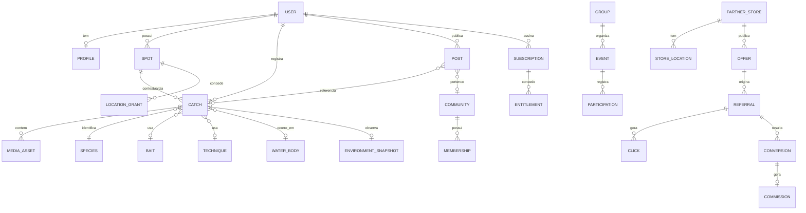

# Modelo Conceitual de Dados

> **Conceitual.** Não há DDL, tipos de coluna, índices concretos ou migrações nesta fase.

## 1. Relações principais

## 2. Identidade

- Identificadores são UUID.
- Entidades criáveis offline têm o UUID gerado **no dispositivo**.
- Identificador de provider externo (auth, billing, storage) é sempre uma referência
  opaca em coluna separada — nunca a chave primária.

## 3. Campos comuns de sincronização

| Campo | Propósito |
|-------|-----------|
| `createdAt` | criação (tempo do servidor na chegada) |
| `updatedAt` | última alteração aceita pelo servidor |
| `deletedAt` | exclusão lógica |
| `version` | detecção de conflito |
| `clientCreatedAt` | tempo informado pelo dispositivo (informativo) |
| `deviceId` | origem da última mutação |
| `serverSeq` | sequência global para cursor de pull |

## 4. Separação dado verdadeiro × dado divulgável

Regra estrutural: a coordenada verdadeira e a coordenada divulgável **não se misturam**.

| Conceito | Onde fica | Quem lê |
|----------|-----------|---------|
| `location` (verdadeira) | Tabela do recurso, acesso restrito | Dono e serviços autorizados |
| Projeção divulgável | Derivada em tempo de resposta pelo Geo Privacy Service | Qualquer observador, conforme autorização |
| Agregação para insight | Tabela separada, já anonimizada | Intelligence |

Nunca existe "view pública" que leia a coluna verdadeira sem passar pela política.

## 5. Catálogos

Espécies, iscas, técnicas, equipamentos, corpos d'água e regiões são catálogos
versionados, com `source` e `license`. São sincronizados por pull (somente leitura no
cliente) e precisam funcionar offline.

## 6. Contadores e agregações

Contadores (seguidores, curtidas, capturas) são derivados. Regra: o valor autoritativo é a
contagem real; o contador é cache com reconciliação periódica. Contador nunca é a fonte
de verdade de autorização nem de ranking.

## 7. Multi-tenant de parceiros

Dados de parceiro são isolados por `partnerStoreId`, com autorização verificada na API.
Não há acesso cruzado entre parceiros.

## 8. O que não fica no banco relacional

| Dado | Onde fica |
|------|-----------|
| Arquivos de mídia | Object storage |
| Tiles de mapa | Provider / pacote offline |
| Logs | Sistema de observabilidade |
| Fila de jobs | Provider de fila |
| Cache de sessão do cliente | SQLite local |
