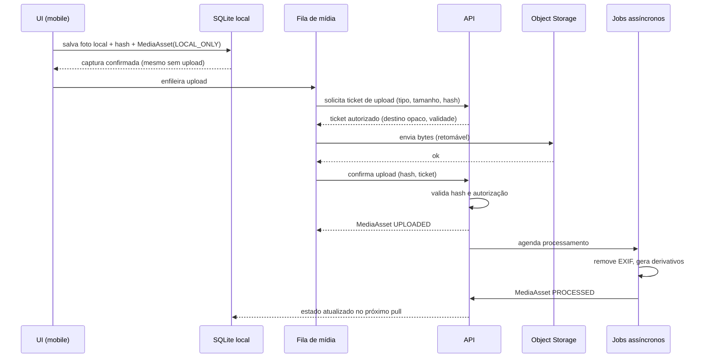

# Sincronização de Mídia

## 1. Diagrama de upload



## 2. Regras

| ID | Regra |
|----|-------|
| MS-1 | O registro (captura/post) **nunca** espera o upload para existir |
| MS-2 | O cliente nunca escreve no storage sem ticket autorizado pela API |
| MS-3 | O hash do conteúdo é calculado no cliente e verificado no servidor |
| MS-4 | Upload é retomável; troca de rede ou fechamento do app não recomeça do zero quando o provider suportar |
| MS-5 | EXIF com GPS é removido antes de qualquer publicação (INV-G08) |
| MS-6 | Arquivo sem registro após janela definida é órfão e é removido (INV-M03) |
| MS-7 | Exclusão de registro agenda exclusão da mídia |
| MS-8 | O mesmo arquivo reenviado (mesmo hash, mesmo dono) não cria duplicata |
| MS-9 | A mídia nunca trafega pelo corpo da API |

## 3. Estados do `MediaAsset`

```
LOCAL_ONLY → UPLOADING → UPLOADED → PROCESSED
       ↘ FAILED (com motivo) ↗
                    ↘ DELETED
```

| Estado | Visível ao usuário | Observação |
|--------|--------------------|------------|
| `LOCAL_ONLY` | Sim, como local | Só existe no dispositivo |
| `UPLOADING` | Sim, com progresso | |
| `UPLOADED` | Sim | Bytes no storage, sem derivativos |
| `PROCESSED` | Sim | Derivativos prontos, EXIF removido |
| `FAILED` | Sim, com ação de reenvio | Motivo exibido |
| `DELETED` | Não | Purga assíncrona |

## 4. Fila no dispositivo

- Persistente (sobrevive a fechamento do app).
- Prioriza mídia de registros mais recentes; permite reordenar por ação do usuário.
- Respeita preferência de rede (ex.: só Wi-Fi) — configurável, com aviso de pendência.
- Backoff exponencial com jitter em falhas transitórias.
- Limite de tentativas antes de marcar `FAILED` com motivo compreensível.

## 5. Processamento assíncrono

| Etapa | Obrigatória |
|-------|-------------|
| Remoção de metadados (EXIF/GPS) | **Sim** |
| Validação de tipo real do arquivo | **Sim** |
| Limite de dimensão e tamanho | Sim |
| Geração de derivativos (thumb, médio) | Sim |
| Verificação de conteúdo abusivo | Pós-MVP (heurística + denúncia) |

Falha de processamento não apaga o original nem o registro: marca o estado e gera alerta.

## 6. Limpeza

| Situação | Ação |
|----------|------|
| Upload confirmado | O original local pode ser liberado conforme preferência do usuário |
| Registro excluído | Mídia agendada para exclusão |
| Ticket expirado sem confirmação | Objeto órfão removido por job |
| Derivativo corrompido | Regerado a partir do original |

## 7. Custo

Mídia é um dos maiores custos do produto (R-032). Mitigações: compressão no cliente,
limite de fotos por registro, derivativos em vez do original para listagens, política de
retenção e CDN com custo previsível.

## 8. Privacidade

- URLs de mídia privada são autenticadas e expiram; **nunca** URL pública adivinhável.
- Nome de arquivo é opaco: não contém usuário, espécie, local nem data.
- Mídia de conteúdo privado não é servida por CDN pública.
