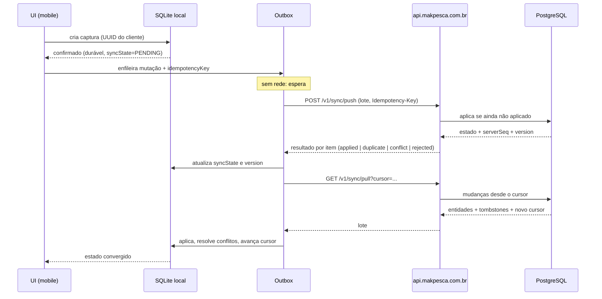

# Protocolo de Sincronização

## 1. Diagrama

## 2. Princípios

1. **Push antes de pull** no ciclo, para que o dispositivo não sobrescreva o que ainda não enviou.
2. Toda mutação carrega identificador de entidade gerado no cliente.
3. Toda mutação carrega `idempotencyKey` única e estável por tentativa lógica.
4. O servidor responde item a item; um item com erro não invalida o lote.
5. O cursor só avança quando o lote é aplicado localmente com sucesso.

## 3. Push

Cada item do lote contém, conceitualmente:

| Campo | Propósito |
|-------|-----------|
| `entityType` | `SPOT`, `CATCH`, `TRIP`, `MEDIA_META`, `PREFERENCE` |
| `entityId` | UUID gerado no cliente |
| `operation` | `CREATE`, `UPDATE`, `DELETE` |
| `baseVersion` | versão em que o cliente baseou a alteração |
| `payload` | campos alterados |
| `idempotencyKey` | estável para a mesma intenção |
| `clientTimestamp` | informativo |
| `deviceId` | origem |

Resultados possíveis por item:

| Resultado | Significado | Ação do cliente |
|-----------|-------------|-----------------|
| `applied` | Aplicado agora | Marca `SYNCED`, guarda `version` |
| `duplicate` | Já havia sido aplicado (mesma chave) | Marca `SYNCED`, sem duplicar |
| `conflict` | `baseVersion` desatualizada | Aplica regra de conflito |
| `rejected` | Inválido ou não autorizado | Mostra erro, não reenvia cegamente |
| `deferred` | Depende de outro item (ex.: mídia) | Mantém pendente |

## 4. Pull

- Por **cursor opaco**, não por timestamp (evita problemas de clock skew e de empate).
- Retorna entidades alteradas, tombstones e o novo cursor.
- Retorna em páginas; o cliente processa cada página de forma transacional.
- Cursor inválido/expirado → o servidor instrui ressincronização completa do escopo.

## 5. Escopo de sincronização

| Escopo | Conteúdo |
|--------|----------|
| Próprio | Pontos, capturas, pescarias, preferências, mídia do usuário |
| Concedido | Recursos de terceiros concedidos ao usuário, **na precisão autorizada** |
| Catálogos | Somente leitura, versionados |
| Regional (opcional) | Conteúdo público baixado para uma região |

**A degradação de precisão acontece no servidor antes de entrar no pull** — o dispositivo
nunca recebe a coordenada verdadeira de terceiro para "filtrar depois".

## 6. Idempotência

- `idempotencyKey` é gerada no cliente e persiste na outbox.
- Reenvio após timeout, crash ou troca de rede usa **a mesma chave**.
- O servidor guarda o resultado da chave por uma janela definida e devolve o mesmo
  resultado.
- Uma nova intenção do usuário (nova edição) gera **nova** chave.

Detalhe do contrato HTTP em `../07-api/API-IDEMPOTENCY.md`.

## 7. Versões e ordenação

- `version` da entidade é definida pelo servidor e só cresce (INV-S04).
- `serverSeq` fornece ordem global para o cursor.
- O tempo do dispositivo nunca decide ordem (INV-S09); é armazenado para exibição e auditoria.
- Clock skew relevante é detectado (diferença entre `clientTimestamp` e chegada) e registrado.

## 8. Exclusões

- Delete gera tombstone com `retainUntil`.
- O pull entrega tombstones; o cliente remove localmente.
- Dispositivo que ficou offline além da janela de retenção recebe instrução de
  ressincronização completa em vez de aplicar um delta incompleto.

## 9. Retry e backoff

| Falha | Política |
|-------|----------|
| Sem rede | Não tenta; aguarda evento de conectividade |
| Timeout / 5xx | Backoff exponencial com jitter, teto definido |
| 409 conflito | Resolve conflito, não repete o mesmo payload |
| 4xx de validação | Não reenvia automaticamente; expõe ao usuário |
| 401 | Renova credencial; se impossível, mantém pendente |
| 429 | Respeita o tempo indicado pelo servidor |

## 10. Multi-dispositivo

Cada dispositivo tem cursor próprio. A convergência acontece via servidor. Dois dispositivos
do mesmo usuário podem divergir temporariamente; a matriz de conflito define o resultado.

## 11. Observabilidade do sync

Métricas mínimas: itens pendentes, idade do item mais antigo, taxa de `duplicate`, taxa de
`conflict`, tempo até convergência, falhas permanentes. **Nenhuma dessas métricas carrega
coordenada.**
