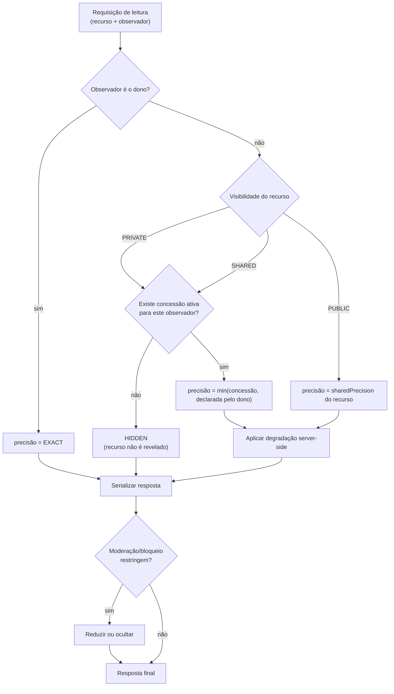

# Geo-Privacidade (SSOT)

Este é o SSOT da regra de negócio de privacidade de localização.
O modelo de ameaças correspondente está em
`../08-security-privacy/GEO-PRIVACY-THREAT-MODEL.md`.

## 1. Os dois eixos

Visibilidade e precisão são **independentes**. Confundi-los é a origem da maioria dos
vazamentos.

### Visibilidade — *quem pode ver o objeto*
| Valor | Significado |
|-------|-------------|
| `PRIVATE` | Só o dono |
| `SHARED` | Dono + destinatários de concessões explícitas |
| `PUBLIC` | Qualquer usuário autenticado (e, se aplicável, público não autenticado) |

### Precisão — *quanto da localização é revelado*
| Valor | O que é retornado |
|-------|-------------------|
| `EXACT` | Coordenada verdadeira |
| `APPROXIMATE` | Coordenada deslocada, com raio declarado |
| `REGION` | Região (centroide/identificador), sem ponto real |
| `WATER_BODY_ONLY` | Apenas o corpo d'água |
| `HIDDEN` | Nenhuma informação de localização |

Um objeto pode ser `PUBLIC` com precisão `WATER_BODY_ONLY`: todos veem a captura,
ninguém sabe onde foi.

## 2. Regra fundamental

> **O usuário sem autorização nunca recebe a coordenada verdadeira.**
> O frontend jamais recebe o dado real "para apenas esconder".

A degradação acontece no servidor, no domínio, antes da serialização.

## 3. Cálculo da precisão efetiva

**Precisão efetiva = a mais restritiva entre:** o que o dono declarou, o que a concessão
concede, o que a moderação/bloqueio permite e o que o contexto de consulta permite.

## 4. Degradação

| Precisão | Como é produzida |
|----------|------------------|
| `APPROXIMATE` | Deslocamento pseudoaleatório **determinístico** por (recurso, observador), dentro de um raio declarado |
| `REGION` | Substituição pelo identificador/centroide da região |
| `WATER_BODY_ONLY` | Substituição pelo identificador do corpo d'água |
| `HIDDEN` | Ausência do campo — não `null` ambíguo que revele existência quando isso for sensível |

Regras:
1. o jitter **nunca** é re-sorteado a cada requisição (INV-G06);
2. o raio é informado ao cliente, para que a interface não minta;
3. a degradação é a mesma em API, push, export, webhooks e telas administrativas;
4. arredondar coordenada **não** é considerado degradação suficiente por si só, porque
   preserva a estrutura de vizinhança — usa-se junto com o raio declarado.

## 5. Independência entre captura e ponto

| Ação | Efeito sobre o ponto |
|------|---------------------|
| Publicar captura | **Nenhum** |
| Tornar captura `PUBLIC` com `EXACT` | Afeta apenas a localização daquela captura |
| Tornar ponto `PUBLIC` | Não publica automaticamente as capturas associadas |

A interface deve perguntar as duas coisas separadamente (J4).

## 6. Concessões (`LocationGrant`)

| Propriedade | Regra |
|-------------|-------|
| Destinatário | Usuário, grupo, participantes de evento ou comunidade |
| Precisão | Definida na concessão, nunca maior que a do dono |
| Prazo | Opcional; expiração automática |
| Revogação | Imediata, com efeito em cache e em dispositivos no próximo sync |
| Encadeamento | **Proibido**: quem recebe não pode repassar |
| Auditoria | Toda concessão e revogação é registrada |

## 7. Defaults

| Objeto | Visibilidade | Precisão |
|--------|--------------|----------|
| Ponto novo | `PRIVATE` | `EXACT` só para o dono |
| Captura nova | `PRIVATE` | — |
| Captura ao publicar | Escolha explícita | Padrão sugerido: `WATER_BODY_ONLY` |
| Ponto de encontro de evento | `SHARED` com participantes | `EXACT` para participantes |
| Loja parceira | `PUBLIC` | `EXACT` (é comércio, endereço é público) |

Padrão nunca é o mais aberto.

## 8. Casos especiais

| Caso | Regra |
|------|-------|
| Usuário bloqueado | Não recebe nada, mesmo de conteúdo `PUBLIC` do bloqueador |
| Conteúdo em moderação | Localização oculta até a decisão |
| Conta excluída | Concessões cessam |
| Administrador | Só acessa coordenada exata com motivo registrado e auditoria |
| Exportação do titular | Recebe suas próprias coordenadas verdadeiras |
| Insight agregado | Passa por coorte mínima (ver `../13-intelligence/PRIVACY-PRESERVING-AGGREGATION.md`) |

## 9. Implementação (regra arquitetural)

- Existe **um único** componente responsável por decidir e aplicar precisão
  (Geo Privacy Service). Nenhum outro código serializa localização.
- Cache de resposta com localização tem o perfil de autorização na chave (INV-G07).
- Testes de contrato por perfil de observador são obrigatórios
  (`../15-quality/PRIVACY-TEST-MATRIX.md`).
