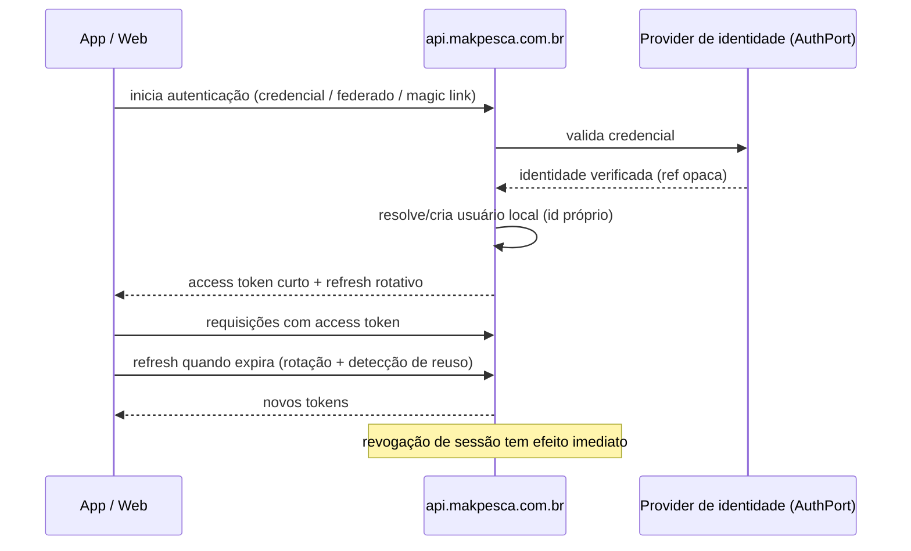

# Opções de Autenticação

## 0. Aviso

**Nenhuma opção foi verificada em fonte primária nesta missão.** Preços, limites e
capacidades precisam de link oficial + data antes da decisão (Q-008).

## 1. Fluxo conceitual

**Regra:** o identificador de usuário do Makpesca é **nosso**, não do provider. O provider
guarda apenas uma referência opaca. Isso é o que torna a migração possível.

## 2. Opções

| Opção | Natureza |
|-------|----------|
| **A. Supabase Auth encapsulado** | Usar o serviço de auth do provider já previsto para banco, atrás de `AuthPort` |
| **B. Clerk** | Serviço especializado de identidade |
| **C. Auth0** | Serviço maduro de identidade |
| **D. Provider open-source maduro auto-hospedado** | Ex.: solução OIDC open-source |
| **E. Solução própria** | Implementar autenticação internamente |

## 3. Critérios

| # | Critério | Peso |
|---|----------|------|
| 1 | Suporte real a mobile (RN/Expo) e web | Alto |
| 2 | Segurança (rotação, revogação, detecção de reuso) | Alto |
| 3 | Login com Apple e Google (exigidos pelas lojas quando há login social) | Alto |
| 4 | Magic link e passkeys | Médio |
| 5 | Custo inicial e em escala | Alto |
| 6 | **Custo e viabilidade de migração de saída** | **Alto** |
| 7 | LGPD: local de processamento, contrato, exclusão de dados | Alto |
| 8 | Exclusão de conta propagada | Alto |
| 9 | Operação (quem mantém, quem responde a incidente) | Médio |
| 10 | Maturidade e suporte | Médio |

## 4. Avaliação preliminar (qualitativa, não verificada)

| Critério | A. Supabase Auth | B. Clerk | C. Auth0 | D. Open-source | E. Própria |
|----------|------------------|----------|----------|----------------|------------|
| Integração com o resto | Alta (mesmo provider) | Média | Média | Média | Total |
| Esforço inicial | Baixo | Baixo | Baixo | Alto | **Muito alto** |
| Custo em escala | A VERIFICAR | A VERIFICAR | A VERIFICAR | Infra própria | Infra + engenharia |
| Custo de saída | A VERIFICAR | A VERIFICAR | A VERIFICAR | Baixo (dados nossos) | Nenhum |
| Risco de segurança próprio | Baixo | Baixo | Baixo | Médio | **Alto** |
| Controle | Médio | Baixo | Baixo | Alto | Total |
| LGPD (local de dados) | A VERIFICAR | A VERIFICAR | A VERIFICAR | Controlado | Controlado |

## 5. Posição preliminar

Solução própria (E) é **desaconselhada**: autenticação é onde erros são mais caros e menos
visíveis. O esforço não constrói diferencial de produto.

A escolha provável fica entre A, B e C, com o `AuthPort` garantindo a saída. A decisão
depende de custo verificado e de LGPD.

## 6. Requisitos inegociáveis, qualquer que seja a opção

1. Identificador de usuário próprio; referência do provider é opaca e substituível.
2. Sessões listáveis e revogáveis pelo usuário.
3. Refresh rotativo com detecção de reuso.
4. Exclusão de conta propaga para o provider.
5. Nenhuma regra de autorização do produto delegada ao provider.
6. Registro de eventos de autenticação sem dado sensível.
7. Plano de migração documentado antes do lançamento.

## 7. Pendências

- Verificar preços e limites com fonte e data.
- Verificar requisitos das lojas para login social.
- Verificar tratamento de dados e local de processamento (LGPD).
- Definir política de senha ou de autenticação sem senha.
