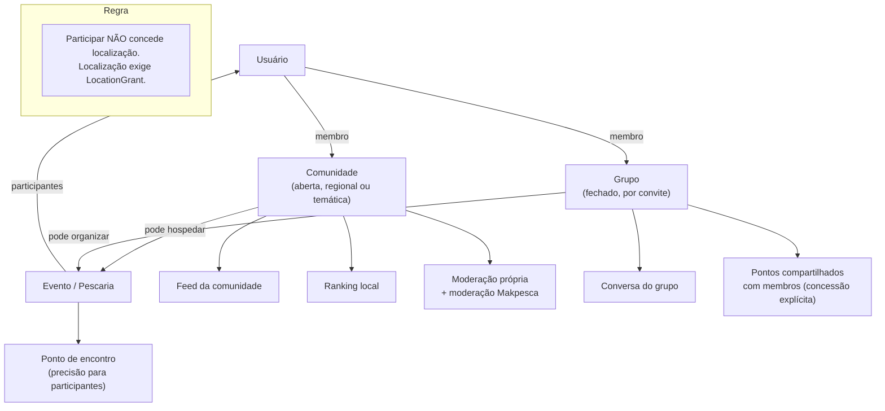

# Modelo de Comunidades

## 1. Relação entre comunidades, grupos e eventos

## 2. Tipos de comunidade

| Tipo | Exemplo | Recorte |
|------|---------|---------|
| `REGIONAL` | Pescadores de Goiás | Região |
| `WATER_BODY` | Represa de Furnas | Corpo d'água |
| `SPECIES` | Tucunaré | Espécie |
| `MODALITY` | Pesca embarcada / fly fishing | Técnica |
| `INTEREST` | Equipamentos, iniciantes, conservação | Tema |

## 3. Estrutura

| Elemento | Descrição |
|----------|-----------|
| Membros | Quem participa, com papel |
| Papéis | `MEMBER`, `MODERATOR`, `ADMIN` |
| Regras | Texto próprio da comunidade, além das regras da plataforma |
| Feed | Publicações, fotos, capturas, discussões |
| Eventos | Pescarias organizadas pela comunidade |
| Ranking local | Pós-MVP, com antifraude |
| Área geográfica | Opcional, para comunidades regionais |

## 4. Entrada

| Política | Descrição |
|----------|-----------|
| `OPEN` | Entra quem quiser |
| `REQUEST` | Sujeito a aprovação |
| `INVITE_ONLY` | Somente convidados |

Comunidade regional pode exigir coerência com a região do perfil — **sem** verificar
localização exata.

## 5. Moderação

Dois níveis:

1. **Moderação da comunidade** — administradores locais aplicam as regras da comunidade;
2. **Moderação da plataforma** — sobrepõe qualquer decisão local em caso de violação das
   regras do Makpesca.

Administrador de comunidade não tem acesso a dados privados dos membros, nem a
localizações, nem a dados de conta.

## 6. Privacidade

| Regra |
|-------|
| Participar de comunidade **não** concede acesso a pontos de ninguém |
| Comunidade recebe, no máximo, precisões baixas (`REGION`, `WATER_BODY_ONLY`) |
| Lista de membros tem visibilidade configurável pela comunidade |
| Sair da comunidade encerra acessos derivados |
| Ranking local nunca revela localização acima do autorizado (INV-R02) |

## 7. Riscos

| Risco | Mitigação |
|-------|-----------|
| Comunidade vira canal de spam comercial | Regras + moderação + limites |
| Vazamento de pontos por pressão social | Interface reforça que compartilhar é opcional |
| Administrador abusivo | Denúncia sobre administradores; plataforma pode intervir |
| Comunidade fantasma / duplicada | Curadoria inicial, mesclagem, limites de criação |
| Sobrecarga de moderação | Limite de crescimento e priorização (R-046) |

## 8. Ciclo de vida

Criação (com curadoria no início) → ativa → inativa (sem atividade) → arquivada.
Comunidade arquivada mantém conteúdo acessível, sem novas publicações.
