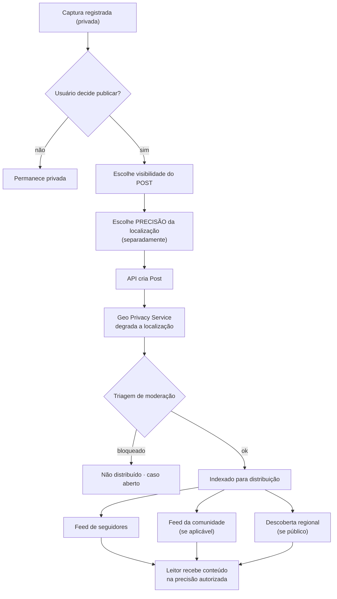

# Modelo de Feed

## 1. Fluxo de publicação

**O ponto do diagrama:** a decisão de precisão é um passo próprio, e a degradação acontece
antes de qualquer distribuição.

## 2. Fontes do feed

| Fonte | Peso | Fase |
|-------|------|------|
| Quem eu sigo | Alto | MVP |
| Comunidades que participo | Alto | Pós-MVP |
| Conteúdo público da minha região | Médio | MVP |
| Espécies/corpos d'água de interesse | Médio | Pós-MVP |
| Eventos próximos | Médio | Pós-MVP |
| Conteúdo de parceiros (rotulado) | Baixo, limitado | Pós-MVP |

## 3. Ordenação

Combinação de: recência, proximidade **regional** (nunca exata), afinidade temática,
engajamento e qualidade/reputação do autor.

Regras:
- o usuário pode alternar para ordem cronológica;
- conteúdo patrocinado é rotulado e tem frequência limitada;
- comissão não influencia o ranking do feed (P9).

## 4. Arquitetura (fan-out)

| Estratégia | Quando |
|------------|--------|
| **Fan-out on read** (montar na leitura) | Início — base pequena, simplicidade (R-040) |
| Fan-out on write (materializar por usuário) | Só quando a medição justificar |
| Híbrido | Contas com muitos seguidores |

Decisão: começar simples e medir. Otimizar antes de medir é overengineering (P10).

## 5. Privacidade no feed

| Regra |
|-------|
| Nenhum item do feed carrega precisão acima da autorizada para aquele leitor |
| Cache de feed é por leitor (INV-G07) |
| Conteúdo de quem me bloqueou não aparece |
| Conteúdo removido por moderação some para todos |
| Despublicar remove do feed em tempo hábil |

## 6. Interações

Curtir, comentar, salvar e compartilhar. Regras: quem pode comentar é configurável;
menções respeitam bloqueio; compartilhar **nunca** aumenta a precisão da localização
original.

## 7. Limites anti-spam

Limite de publicações por janela, limite de comentários por minuto, detecção de conteúdo
repetido, limite para contas novas, e redução de alcance para conta sob sanção.
