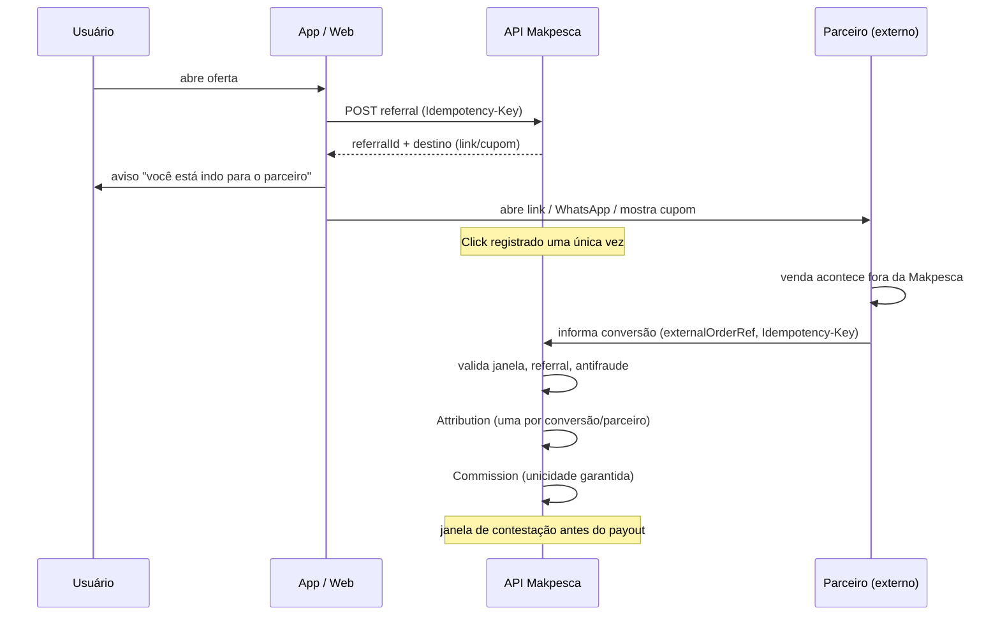

# Atribuição

## 1. Fluxo de atribuição

## 2. Regra de atribuição

| Aspecto | Definição proposta |
|---------|--------------------|
| Modelo | **Last-click** dentro de uma janela |
| Janela | A definir (proposta inicial: 7 dias) — `NEEDS-DECISION` |
| Conflito entre parceiros | Vence o último click válido dentro da janela |
| Cupom vs click | Cupom tem precedência (é evidência mais forte) |
| Sem referral | Sem comissão |
| Múltiplos clicks do mesmo usuário na mesma oferta | Um único referral ativo, renovado |

A regra precisa ser **explícita e auditável**: o parceiro deve conseguir entender por que
uma conversão foi ou não atribuída (R-053).

## 3. Registro de click

| Campo | Observação |
|-------|------------|
| `referralId` | Identificador próprio |
| `userId` | Interno; nunca enviado ao parceiro |
| `offerId` / `partnerStoreId` | Contexto |
| `channel` | `WEB_LINK`, `WHATSAPP`, `COUPON`, `IN_STORE` |
| `occurredAt` | Tempo do servidor |
| `idempotencyKey` | Evita duplicação por toque duplo/reenvio |
| `fraudSignals[]` | Indícios |

**Log de click é imutável**: correções geram novo registro, nunca alteram o histórico.

## 4. Registro de conversão

| Campo | Observação |
|-------|------------|
| `externalOrderRef` | Referência do pedido no parceiro — **chave de unicidade** |
| `partnerStoreId` | Parceiro |
| `amount` | Quando informado |
| `occurredAt` | Data da compra |
| `source` | `PARTNER_REPORTED`, `INTEGRATION`, `RECONCILIATION` |
| `status` | `PENDING`, `VALIDATED`, `REJECTED`, `REVERSED` |

Unicidade: `(partnerStoreId, externalOrderRef)` — impede comissão duplicada (INV-C01).

## 5. Idempotência

Três camadas (ver `../07-api/API-IDEMPOTENCY.md`):

1. `Idempotency-Key` no registro de click e de conversão;
2. unicidade `(parceiro, pedido externo)` no banco;
3. verificação de estado desejado no cálculo de comissão, nunca incremento.

## 6. Estorno

Devolução, cancelamento ou fraude confirmada geram estorno: a comissão muda de estado,
**sem apagar** o histórico. Se já foi paga, entra como ajuste no próximo payout.

## 7. Auditoria

Toda conversão tem trilha: click → referral → conversão → atribuição → comissão → payout.
Qualquer elo deve ser reconstituível em disputa com o parceiro.

## 8. Privacidade

O parceiro recebe apenas a referência do pedido e as métricas agregadas.
Nunca recebe: identidade, contato, localização ou dados de pesca do usuário.
