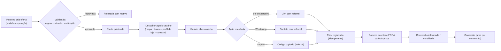

# Ofertas

## 1. Fluxo de uma oferta

## 2. Estrutura de uma oferta

| Campo | Obrigatório |
|-------|-------------|
| Título | Sim |
| Descrição | Sim |
| Condições | Sim (o que vale, o que não vale) |
| Período de validade | **Sim** |
| Loja e unidades participantes | Sim |
| Categoria/marca | Recomendado |
| Imagem | Recomendado |
| Cupom | Opcional |
| Link de destino | Opcional |
| Limite de uso | Opcional |
| Público-alvo | Região; **nunca** localização exata |

## 3. Regras

| # | Regra |
|---|-------|
| 1 | Oferta sem validade não é publicada |
| 2 | Oferta vencida não é exibida (INV-C04) |
| 3 | Condições precisam ser compreensíveis antes do clique |
| 4 | Oferta é identificada como conteúdo de parceiro (INV-C05) |
| 5 | Preço anunciado é responsabilidade do parceiro; a Makpesca não vende |
| 6 | Oferta denunciada como enganosa é revisada e pode ser removida |
| 7 | Segmentação usa região, interesse e espécie — nunca ponto de pesca do usuário |

## 4. Exibição

| Local | Regra |
|-------|-------|
| Perfil da loja | Todas as ofertas vigentes |
| Mapa | Lojas próximas com indicação de oferta |
| Busca | Por categoria, marca, região |
| Feed | Limitado, rotulado, com frequência controlada |
| Contexto | Ex.: ao planejar uma pescaria na região |

Nunca interromper o fluxo de campo do usuário (marcar ponto, registrar captura) com
oferta.

## 5. Rastreamento

Toda ação de saída gera um `Referral` e um `Click`, com idempotência (um toque duplo não
conta dois cliques). O usuário é informado de que está saindo para o parceiro.

Detalhe em `ATTRIBUTION.md`.

## 6. Métricas

Impressões, cliques, taxa de clique, conversões conciliadas, denúncias.
Métricas do parceiro são agregadas e anônimas.

## 7. O que não fazemos

- Checkout dentro do app (fora de escopo inicial).
- Custódia de pagamento.
- Garantia de preço, estoque ou entrega.
- Segmentação por localização exata.
- Notificação push promocional sem consentimento específico.
