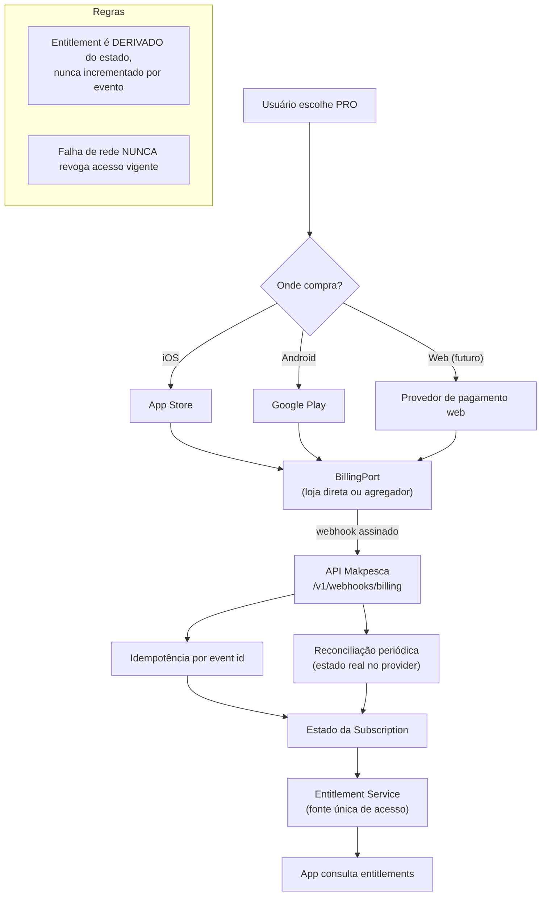

# Arquitetura de Billing

## 1. Fluxo conceitual

## 2. Componentes

| Componente | Responsabilidade |
|------------|------------------|
| `BillingPort` | Abstrair loja/agregador |
| Webhook receiver | Receber, verificar assinatura, enfileirar |
| Subscription state | Estado da assinatura por usuário |
| **Entitlement Service** | **Fonte única** do que o usuário pode fazer |
| Reconciliação | Comparar nosso estado com o do provider |
| Auditoria | Histórico de mudanças de assinatura e entitlement |

## 3. Opções de provider

| Opção | Vantagem | Desvantagem |
|-------|----------|-------------|
| Integração direta com App Store e Google Play | Sem intermediário, sem taxa extra | Duas integrações, muitos casos de borda, validação de recibo própria |
| Agregador (ex.: RevenueCat ou equivalente) | Uma integração, casos de borda resolvidos, relatórios | Custo adicional, dependência, dado em terceiro |
| Assinatura web própria | Margem melhor | Novo conjunto de regras; as lojas restringem venda externa |

**Decisão aberta (Q-010, ADR-0014).** Preços e políticas das lojas precisam ser verificados
com fonte e data antes de decidir.

## 4. Regras invioláveis

| ID | Regra |
|----|-------|
| B1 | Entitlement é derivado do estado da assinatura, nunca incrementado (INV-B01) |
| B2 | Webhook duplicado não concede acesso duplicado (INV-B02, R-051) |
| B3 | Falha de comunicação nunca revoga acesso vigente (INV-B03) |
| B4 | Restore recupera os mesmos entitlements (INV-B04) |
| B5 | Cancelamento mantém acesso até o fim do período pago (INV-B05) |
| B6 | O cliente **nunca** decide entitlement — só consulta |
| B7 | Nenhum dado de cartão passa pela Makpesca |
| B8 | Toda mudança de assinatura é auditada |

## 5. Casos de borda a tratar

Compra em um sistema operacional e uso em outro; troca de conta da loja; reembolso;
assinatura em família/compartilhada; upgrade/downgrade no meio do período; trial;
renovação com falha temporária; grace period; assinatura expirada com app offline;
compra duplicada; conta da loja diferente da conta Makpesca; fraude de recibo.

Cada um precisa de comportamento definido antes da implementação.

## 6. Webhooks

| Regra |
|-------|
| Verificar assinatura antes de processar |
| Responder rápido; processar assíncrono |
| Idempotência por identificador de evento |
| Ordem não garantida: processar por estado final, não por sequência |
| Evento antigo não sobrescreve estado mais novo |
| Evento desconhecido é registrado, não ignorado silenciosamente |

## 7. Reconciliação

Periodicamente, comparar nosso estado com o do provider. Divergência gera alerta e caso.
"Pagou e não tem acesso" é incidente de prioridade alta; "tem acesso sem pagar" é perda
de receita, corrigida com cuidado para não punir o usuário por erro nosso.

## 8. Offline

O app guarda entitlements com validade em cache. Sem rede, continua valendo o último
estado conhecido dentro da validade. Expirou e sem rede: manter acesso e revalidar na
próxima conexão — **nunca** bloquear alguém no meio do rio por falta de sinal.
