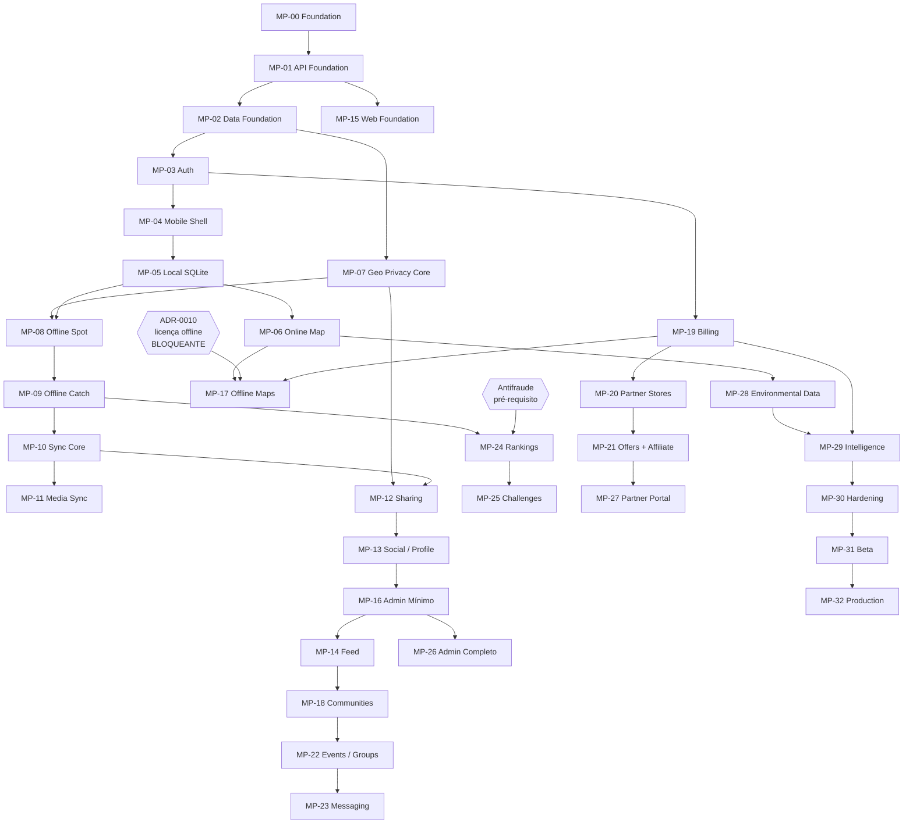

# Mapa de Dependências

## 1. Dependências entre slices



## 2. Caminho crítico

```
MP-00 → MP-01 → MP-02 → MP-03 → MP-04 → MP-05 → MP-07 → MP-08 → MP-09 → MP-10
```

Qualquer atraso nesses dez slices atrasa tudo. O mais arriscado é **MP-10 (Sync Core)**:
é onde os defeitos são mais difíceis de detectar e mais caros de corrigir depois.

## 3. Dependências de decisão (ADRs)

| Slice | Depende de | Estado |
|-------|-----------|--------|
| MP-01 | ADR-0006 (framework) | **OPEN** |
| MP-02 | ADR-0004, ADR-0007 | ADR-0007 **OPEN** |
| MP-03 | ADR-0008 (auth) | **OPEN** |
| MP-06 | ADR-0009 (mapa online) | PROPOSED |
| MP-07 | ADR-0012 (geo-privacy) | ACCEPTED |
| MP-10 | ADR-0011 (sync) | PROPOSED |
| MP-11 | ADR-0013 (storage) | PROPOSED |
| MP-17 | **ADR-0010 (mapa offline)** | **OPEN — BLOQUEANTE** |
| MP-19 | ADR-0014 (billing) | **OPEN** |
| MP-21 | ADR-0020 (atribuição) | PROPOSED |
| MP-23 | ADR-0019 (mensageria) | **OPEN** |
| MP-27 | ADR-0021 (portal) | PROPOSED |

## 4. Dependências de perguntas abertas

| Pergunta | Bloqueia |
|----------|----------|
| Q-001 owners | Tudo (F0) |
| **Q-004/Q-005 licença de mapa offline** | MP-17, F5, e a promessa de "mapas offline" |
| Q-006 framework | MP-01 |
| Q-007 ORM | MP-02 |
| Q-008 auth | MP-03 |
| Q-010 billing | MP-19 |
| Q-013 dados ambientais | MP-28, MP-29 |
| Q-019/Q-020 comissão e payout | MP-21 |
| Q-023 coorte mínima | MP-29 |

## 5. Dependências externas

| Dependência | Impacto se falhar |
|-------------|-------------------|
| Licença de mapa offline | Recurso central some ou muda de forma |
| Aprovação nas lojas de aplicativos | Lançamento bloqueado |
| Regras de billing das lojas | Modelo de monetização muda |
| Fontes de dados ambientais | Inteligência e PRO perdem valor |
| Parceiros comerciais piloto | Receita de afiliados não valida |
| Revisão jurídica (LGPD, desafios) | Recursos precisam ser adiados |

## 6. Riscos de sequenciamento

| Risco | Consequência | Mitigação |
|-------|--------------|-----------|
| Construir pontos antes da geo-privacy | Dados legados inseguros e retrabalho | MP-07 antes de MP-08 |
| Construir app antes da API | Trabalho descartado | MP-01 antes de MP-04 |
| Abrir social antes da moderação | Incidente sem ferramenta de resposta | MP-16 antes de MP-14 público |
| Lançar ranking antes do antifraude | Incentivo impossível de policiar | Antifraude em MP-24 |
| Prometer offline antes de ADR-0010 | Promessa que pode não ser cumprida | Não anunciar antes da decisão |
| Otimizar feed antes de medir | Complexidade desnecessária | Fan-out on read primeiro |

## 7. Paralelização possível

| Podem correr em paralelo |
|--------------------------|
| MP-15 (Web) com MP-05..MP-09 (mobile) |
| MP-28 (ambiental) com MP-13..MP-14 (social) |
| MP-20 (lojas) com MP-18 (comunidades) |
| Pesquisa de ADR-0010 com **todo** o restante — e deve começar imediatamente |
